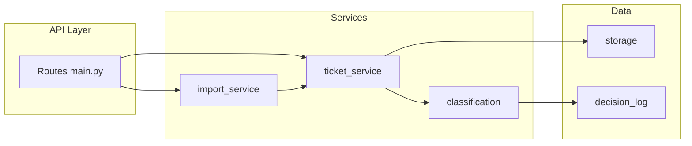
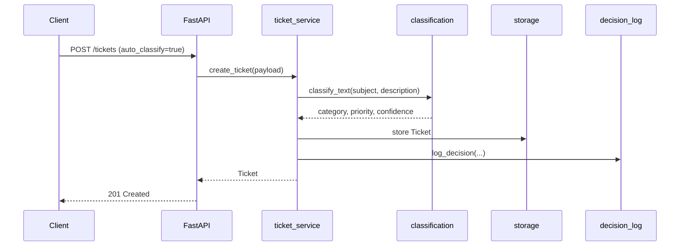

# Architecture — Customer Support Ticket System

## High-Level Architecture

## Component Descriptions

| Component | Responsibility |
|-----------|----------------|
| `main.py` | HTTP routing, status codes, request/response mapping |
| `models.py` | Pydantic schemas, validation, enums |
| `storage.py` | Thread-safe in-memory persistence & filtering |
| `import_service.py` | CSV/JSON/XML parsing and bulk import summary |
| `classification.py` | Keyword rules for category and priority |
| `ticket_service.py` | Ticket creation, optional auto-classify, classify endpoint |
| `decision_log.py` | Append-only classification audit trail |

## Data Flow — Ticket Creation with Auto-Classify

## Design Decisions

1. **In-memory storage** — Keeps the homework self-contained without DB setup; thread lock supports concurrent integration tests.
2. **Rule-based classifier** — Transparent, testable, no external ML dependency; matches homework keyword requirements.
3. **Separate import parsers** — Each format has dedicated parser functions for isolated unit testing.
4. **207 Multi-Status for partial import** — Communicates partial success when some rows fail validation.

## Trade-offs

| Choice | Benefit | Cost |
|--------|---------|------|
| In-memory store | Zero infra, fast tests | Data lost on restart |
| Keyword classifier | Deterministic, easy to test | Less accurate than ML |
| Pydantic v2 | Strong validation | Strict schema maintenance |

## Security Considerations

- Email and string length validation at API boundary
- Path traversal not applicable (no arbitrary file reads except uploaded import content)
- No authentication (homework scope); production would add authn/authz

## Performance Considerations

- O(n) list filtering acceptable for homework scale
- Import parses entire file in memory — fine for sample sizes (50–100 records)
- Performance tests assert sub-200ms for core endpoints on local machine
