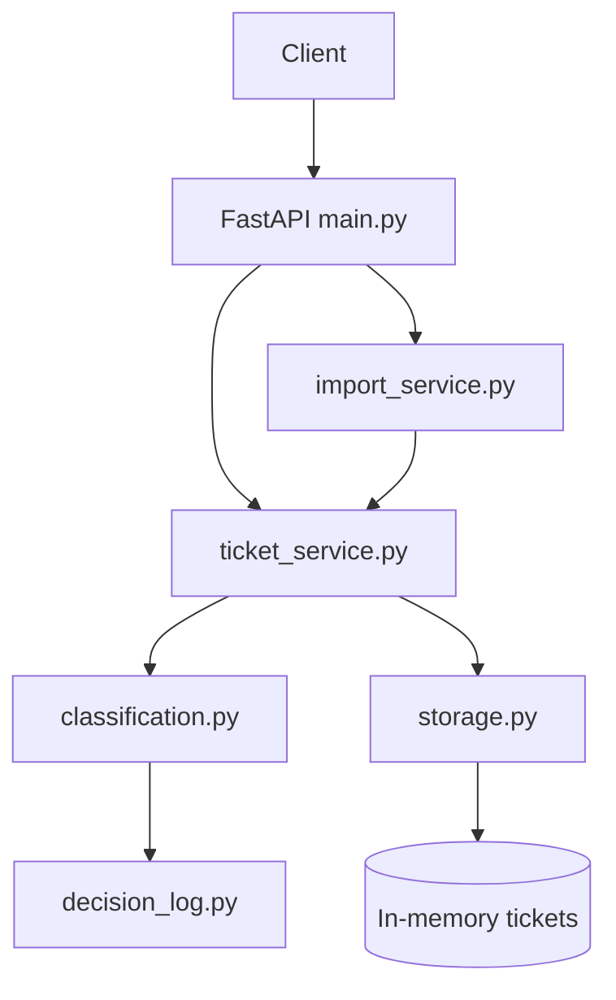

# Homework 2 — Intelligent Customer Support System

> **Student Name**: Kuchuk Oleksandr  
> **AI Tools Used**: Cursor (Composer), GPT-based models for docs/tests

---

## Project Overview

A FastAPI REST service for managing customer support tickets with:

- CRUD API for tickets
- Bulk import from **CSV, JSON, and XML**
- Keyword-based **auto-classification** (category + priority + confidence)
- Comprehensive pytest suite with **>85% coverage**

## Architecture



## Features

| Feature | Description |
|---------|-------------|
| Ticket CRUD | Create, list (filter), get, update, delete |
| Import | `POST /tickets/import` with format `csv` / `json` / `xml` |
| Auto-classify | On create (`auto_classify=true`) or `POST /tickets/{id}/auto-classify` |
| Logging | Classification decisions at `GET /classification/decisions` |

## Installation

```powershell
cd homework-2
py -m pip install -r requirements.txt
```

## Run the API

```powershell
py -m uvicorn src.main:app --reload --port 8000
```

Open Swagger UI: http://127.0.0.1:8000/docs

## Run Tests

```powershell
py -m pytest -q
```

Coverage threshold is enforced at **85%** via `pytest.ini`.

## Project Structure

```
homework-2/
├── src/
│   ├── main.py              # FastAPI routes
│   ├── models.py            # Pydantic models & enums
│   ├── storage.py           # In-memory store
│   ├── import_service.py    # CSV/JSON/XML parsers
│   ├── classification.py    # Category & priority rules
│   ├── ticket_service.py    # Create & classify logic
│   └── decision_log.py      # Classification audit log
├── tests/                   # 56 tests across 8 files
├── sample_tickets.csv       # 50 tickets
├── sample_tickets.json      # 20 tickets
├── sample_tickets.xml       # 30 tickets
├── API_REFERENCE.md
├── ARCHITECTURE.md
├── TESTING_GUIDE.md
└── HOWTORUN.md
```

## AI Model Usage (Context-Model-Prompt)

| Task | Model choice | Rationale |
|------|--------------|-----------|
| API implementation | Fast reasoning / Composer | Structured code generation |
| Test suite | Composer | Fast iteration on test cases |
| API docs | General-purpose model | Clear examples for consumers |
| Architecture docs | Reasoning model | Trade-off analysis |

---

*Completed as part of the AI-Assisted Development course.*
