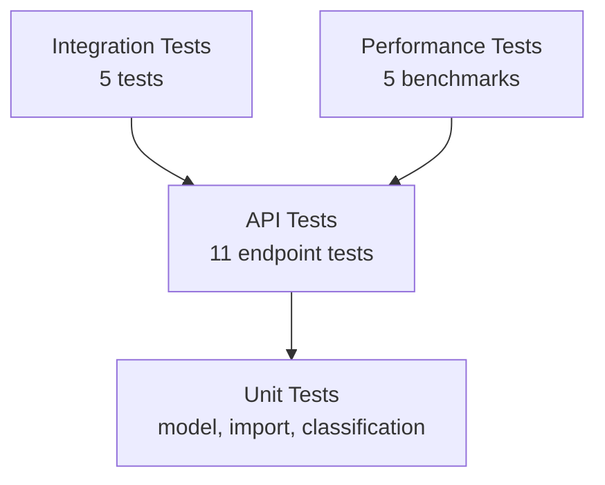

# Testing Guide — Customer Support Ticket System

## Test Pyramid



## Running Tests

```powershell
cd homework-2
py -m pytest -q
```

With verbose coverage:

```powershell
py -m pytest --cov=src --cov-report=term-missing
```

## Test File Map

| File | Count | Focus |
|------|-------|-------|
| test_ticket_api.py | 11 | CRUD, filters, auto-classify |
| test_ticket_model.py | 9 | Pydantic validation |
| test_import_csv.py | 6 | CSV parsing & import |
| test_import_json.py | 5 | JSON parsing & import |
| test_import_xml.py | 5 | XML parsing & import |
| test_categorization.py | 10 | Category/priority rules |
| test_integration.py | 5 | Lifecycle, concurrency, filters |
| test_performance.py | 5 | Latency benchmarks |

**Total: 56 tests** | **Coverage target: >85%** (currently ~95%)

## Sample Test Data

| Location | Purpose |
|----------|---------|
| `sample_tickets.csv` | 50 valid tickets |
| `sample_tickets.json` | 20 valid tickets |
| `sample_tickets.xml` | 30 valid tickets |
| `tests/fixtures/invalid_tickets.*` | Negative import tests |
| `tests/fixtures/valid_tickets.*` | Small import fixtures |

## Manual Testing Checklist

- [ ] Create ticket with `auto_classify=true`
- [ ] Import CSV and verify summary counts
- [ ] Filter tickets by category and priority
- [ ] Run auto-classify on existing ticket
- [ ] Manually override category via PUT
- [ ] Verify 404 for unknown ticket ID
- [ ] Import invalid file and confirm graceful errors

## Performance Benchmarks

| Operation | Target | Test |
|-----------|--------|------|
| Create ticket | < 200 ms | test_create_ticket_under_200ms |
| List tickets (10 items) | < 200 ms | test_list_tickets_under_200ms |
| Auto-classify | < 200 ms | test_auto_classify_under_200ms |
| CSV import (1 row) | < 500 ms | test_import_small_csv_under_500ms |
| Filter query | < 200 ms | test_filter_query_under_200ms |

## Coverage Screenshot

Save pytest coverage output to:

`docs/screenshots/test_coverage.png`

```powershell
py -m pytest --cov=src --cov-report=term-missing
```

Capture the terminal output showing **>85%** total coverage.
